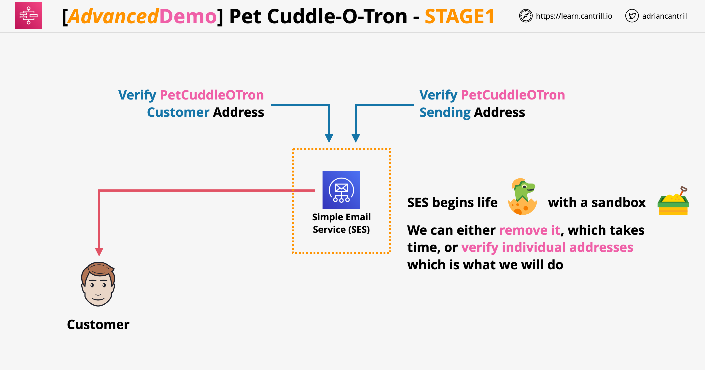
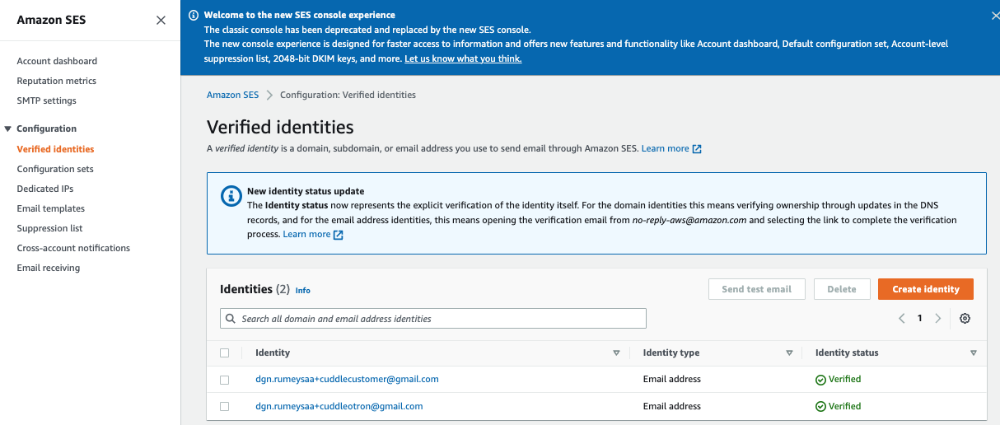

# Advanced Demo Serverless Application - Pet-Cuddle-O-Tron

This advanced demo consists of 6 stages :-

- STAGE 1 : Configure Simple Email service **<= THIS STAGE**
- STAGE 2 : Add a email lambda function to use SES to send emails for the serverless application
- STAGE 3 : Implement and configure the state machine, the core of the application
- STAGE 4 : Implement the API Gateway, API and supporting lambda function
- STAGE 5 : Implement the static frontend application and test functionality
- STAGE 6 : Cleanup the account

  

# STAGE 1A - VERIFY SES APPLICATION SENDING EMAIL ADDRESS

The Pet-Cuddle-O-Tron application is going to send reminder messages via SMS and Email.  It will use the simple email service or SES. In production, it could be configured to allow sending from the application email, to any users of the application. SES starts off in sandbox mode, which means you can only sent to verified addresses (to avoid you spamming). 

There is a whole [process to get SES out of sandbox mode](https://docs.aws.amazon.com/ses/latest/DeveloperGuide/request-production-access.html), which you could do, but for this demo to keep things quick - we will verify the sender address and the receiver address.  

Ensure you are logged into an AWS account, have admin privileges and are in the `us-east-1` / `N. Virginia` Region  
Move to the `SES` console https://console.aws.amazon.com/ses/home?region=us-east-1#  
Click on `Verified Identities` under Configuration 
Click `Create Identity`  
Check the 'Email Address' checkbox  
Ideally you will need a `sending` email address for the application and a `receiving email address` for your test customer. But you can use the same email for both.  

For my application email ... the email the app will send from i'm going to use `adrian+cuddleotron@cantrill.io`  
Enter whatever email you want to use to send in the box (it needs to be a valid address as it will be checked)  
Click `Create Identity`  
You will receive an email to this address containing a link to click  
Click that link   
You should see a `Congratulations!` message  
Return to the SES console and `Refresh` your browser, the verification status should now be `verified`  
Record this address somewhere save as the `PetCuddleOTron Sending Address`  

# STAGE 1B - VERIFY SES APPLICATION CUSTOMER EMAIL ADDRESS

If you want to use a different email address for the test customer (recommended), follow the steps below  
Click `Create Identity`  
Check the 'Email Address' checkbox 
For my application email ... the email for my test customer is  `adrian+cuddlecustomer@cantrill.io`  
Enter whatever email you want to use to send in the box (it needs to be a valid address as it will be checked)  
Click `Create Identity`   
You will receive an email to this address containing a link to click  
Click that link   
You should see a `Congratulations!` message  
Return to the SES console and refresh your browser, the verification status should now be `verified`  
Record this address somewhere save as the `PetCuddleOTron Customer Address`  

# STAGE 1C - Verify an SMS number

Move to the SNS Console https://us-east-1.console.aws.amazon.com/sns/v3/home?region=us-east-1#/dashboard  
Click the 'Hamburger' menu icon on the left.  
Click `Text Messaging (SMS)` under `Mobile`.  
Scroll down and in `Sandbox destination phone numbers` click `Add phone number`.  
Enter the international number format of a phone number you control.  
Pick the `verification message language` you want to use. 
Click `Add phone Number`.  
**if you get an error here saying `no origination entities available to send`, click `Cancel` and skip to Stage 1D**  
you will recieve a verification number on your phone, enter it onto the `Verification code` box and click `Verify phone number`.  

# STAGE 1D - Verify an SMS Number (US and other countries requiring an origination number)  
Click `Origination numbers` under `Mobile` or move to `Pinpoint` console in a new tab, and click `phone numbers` under `SMS and Voice`. 
Click `Request phone number`.  
Choose the country of your phone number in the `Country` dropdown.  
Select `Toll-free` from `number type`.  
for `Default message type` pick `Transactional`.  
Scroll down, click `Next` then `Request`.  

Move back to the `SNS Console` https://us-east-1.console.aws.amazon.com/sns/v3/home?region=us-east-1#/dashboard  
Click the 'Hamburger' menu icon on the left.   
Click `Text Messaging (SMS)` under `Mobile`.   
Scroll down and in `Sandbox destination phone numbers` click `Add phone number`.   
Enter the international number format of a phone number you control.   
Pick the `verification message language` you want to use.  
Click `Add phone Number`.   
you will recieve a verification number on your phone, enter it onto the `Verification code` box and click `Verify phone number`.  

# STAGE 1 - FINISH   

At this point you have whitelisted 2 email addresses for use with SES.  

- the `PetCuddleOTron Sending Address`. 
- the `PetCuddleOTron Customer Address`. 

You have also configured an SMS number within SNS and if required an origination number in Amazon Pinpoint.  

These will be configured and used by the application in later stages. AT this point you have finished all the tasks needed in this STAGE of the Advanced Demo Lesson