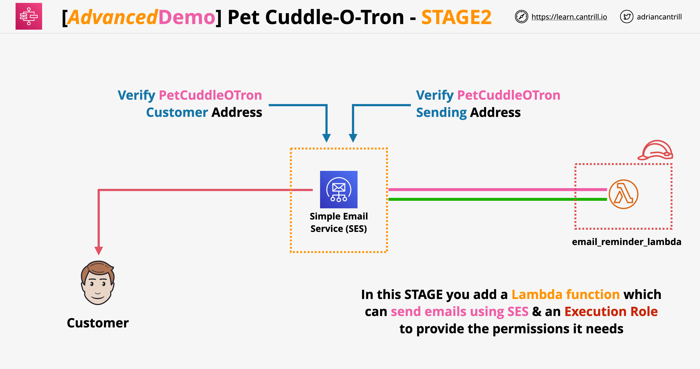
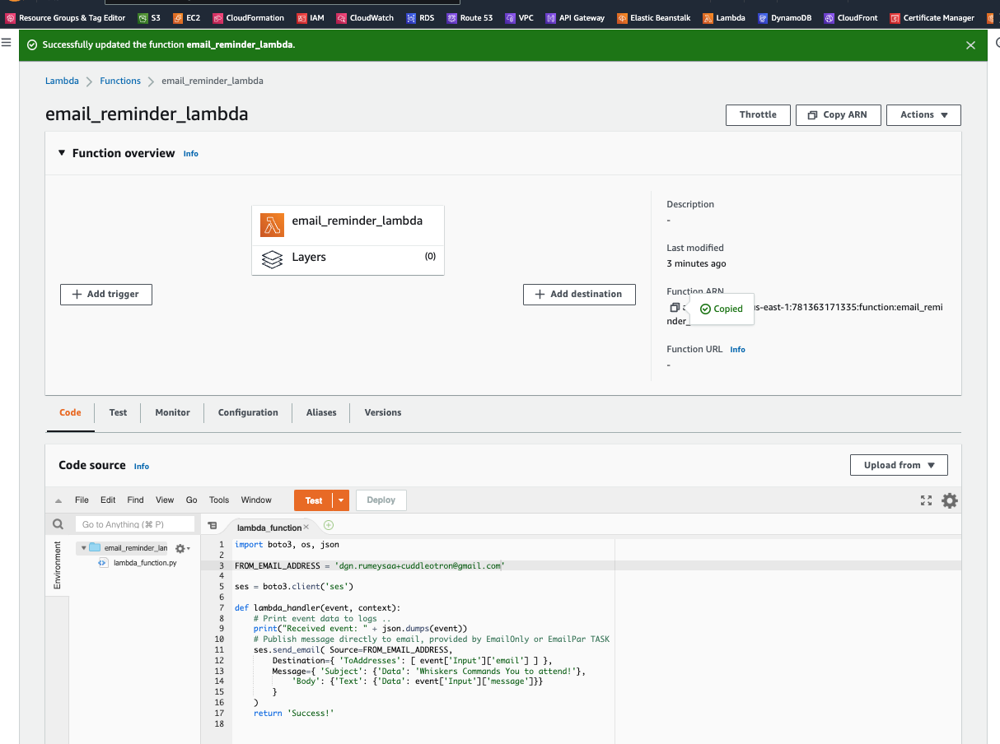

# Advanced Demo Serverless Application - Pet-Cuddle-O-Tron

In this _Advanced Demo_ you will be implementing a serverless reminder application.
The application will load from an S3 bucket and run in browser
.. communicating with Lambda and Step functions via an API Gateway Endpoint
Using the application you will be able to configure reminders for 'pet cuddles' to be send using email and SMS.

This advanced demo consists of 6 stages :-

- STAGE 1 : Configure Simple Email service 
- STAGE 2 : Add a email lambda function to use SES to send emails for the serverless application **<= THIS STAGE**
- STAGE 3 : Implement and configure the state machine, the core of the application
- STAGE 4 : Implement the API Gateway, API and supporting lambda function
- STAGE 5 : Implement the static frontend application and test functionality
- STAGE 6 : Cleanup the account



# STAGE2 VIDEO GUIDE 
[STAGE2 VIDEO GUIDE](https://youtu.be/MicGrt0_KUg)

# STAGE 2A - CREATE THE Lambda Execution Role for Lambda

In this stage of the demo you need to create an IAM role which the email_reminder_lambda will use to interact with other AWS services.  
You could create this manually, but its easier to do this step using cloudformation to speed things up.  
Click https://console.aws.amazon.com/cloudformation/home?region=us-east-1#/stacks/quickcreate?templateURL=https://learn-cantrill-labs.s3.amazonaws.com/aws-serverless-pet-cuddle-o-tron/lambdarolecfn.yaml&stackName=LAMBDAROLE 
Check the `I acknowledge that AWS CloudFormation might create IAM resources.` box and then click `Create Stack`    

Wait for the Stack to move into the `CREATE_COMPLETE` state before moving into the next  

Move to the IAM Console https://console.aws.amazon.com/iam/home?#/roles and review the execution role  
Notice that it provides SES, SNS and Logging permissions to whatever assumes this role.    
This is what gives lambda the permissions to interact with those services    


# STAGE 2B - Create the email_reminder_lambda function

Next You're going to create the lambda function which will will be used by the serverless application to create an email and then send it using `SES`  
Move to the lambda console https://console.aws.amazon.com/lambda/home?region=us-east-1#/functions  
Click on `Create Function`  
Select `Author from scratch`  
For `Function name` enter `email_reminder_lambda`  
and for runtime click the dropdown and pick `Python 3.9`  
Expand `Change default execution role`  
Pick to `Use an existing Role`  
Click the `Existing Role` dropdown and pick `LambdaRole` (there will be randomness and thats ok)  
Click `Create Function`  

# STAGE 2C - Configure the email_reminder_lambda function

Scroll down, to `Function code`  
in the `lambda_function` code box, select all the code and delete it  

Paste in this code

```
import boto3, os, json

FROM_EMAIL_ADDRESS = 'REPLACE_ME'

ses = boto3.client('ses')

def lambda_handler(event, context):
    # Print event data to logs .. 
    print("Received event: " + json.dumps(event))
    # Publish message directly to email, provided by EmailOnly or EmailPar TASK
    ses.send_email( Source=FROM_EMAIL_ADDRESS,
        Destination={ 'ToAddresses': [ event['Input']['email'] ] }, 
        Message={ 'Subject': {'Data': 'Whiskers Commands You to attend!'},
            'Body': {'Text': {'Data': event['Input']['message']}}
        }
    )
    return 'Success!'
  
```

This function will send an email to an address it's supplied with (by step functions) and it will be FROM the email address we specify.    
Select `REPLACE_ME` and replace with the `PetCuddleOTron Sending Address` which you noted down in `STAGE1`    
Click `Deploy` to configure the lambda function    
Scroll all the way to the top, and click the `copy` icon next to the lambda function ARN.  
Note this ARN down somewhere same as the `email_reminder_lambda` ARN    

# STAGE 2 - FINISH   

At this point you have configured the lambda function which will be used eventually to send emails on behalf of the serverless application.    
You can go ahead and move onto stage 3 of the advanced demo.   