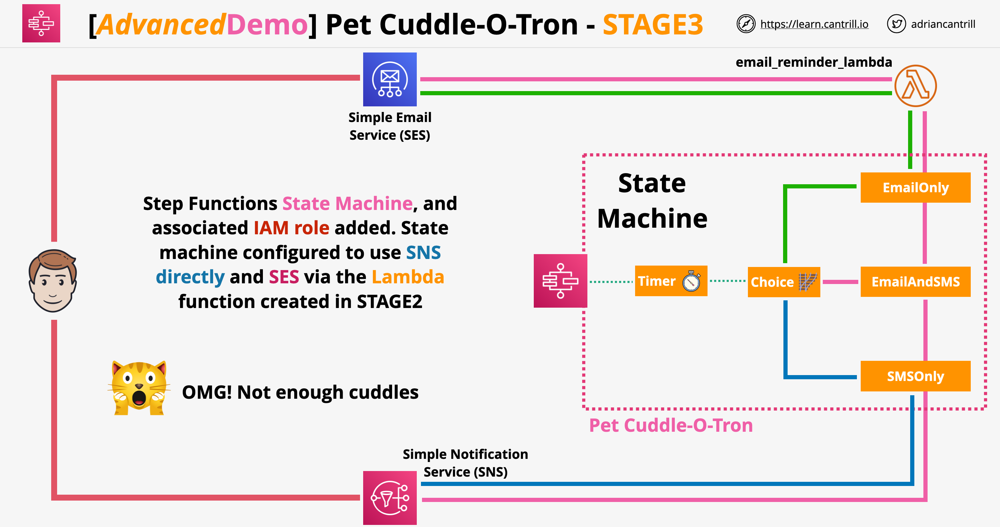
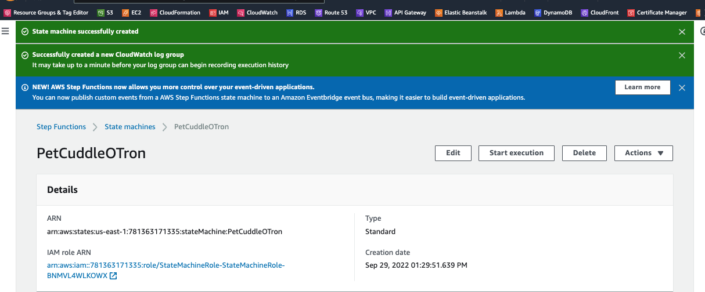

# Advanced Demo Serverless Application - Pet-Cuddle-O-Tron
In this _Advanced Demo_ you will be implementing a serverless reminder application.
The application will load from an S3 bucket and run in browser
.. communicating with Lambda and Step functions via an API Gateway Endpoint
Using the application you will be able to configure reminders for 'pet cuddles' to be send using email and SMS.

This advanced demo consists of 6 stages :-

- STAGE 1 : Configure Simple Email service 
- STAGE 2 : Add a email lambda function to use SES to send emails for the serverless application 
- STAGE 3 : Implement and configure the state machine, the core of the application **<= THIS STAGE**
- STAGE 4 : Implement the API Gateway, API and supporting lambda function
- STAGE 5 : Implement the static frontend application and test functionality
- STAGE 6 : Cleanup the account

# STAGE3 VIDEO GUIDE 
[STAGE3 VIDEO GUIDE](https://youtu.be/8lVPdrF97LI)

# STAGE 3A - CREATE STATE MACHINE ROLE
In this stage of the demo you need to create an IAM role which the state machine will use to interact with other AWS services.  
You could create this manually, but its easier to do this step using cloudformation to speed things up.  
Click https://console.aws.amazon.com/cloudformation/home?region=us-east-1#/stacks/quickcreate?templateURL=https://learn-cantrill-labs.s3.amazonaws.com/aws-serverless-pet-cuddle-o-tron/statemachinerole.yaml&stackName=StateMachineRole 
Check the `I acknowledge that AWS CloudFormation might create IAM resources.` box and then click `Create Stack`  

Wait for the Stack to move into the `CREATE_COMPLETE` state before moving into the next 

Move to the IAM Console https://console.aws.amazon.com/iam/home?#/roles and review the STATE MACHINE role
note how it gives 

- logging permissions
- the ability to invoke the email lambda function when it needs to send emails
- the ability to use SNS to send text messages

# STAGE 3B - CREATE STATE MACHINE
Move to the AWS Step Functions Console https://console.aws.amazon.com/states/home?region=us-east-1#/homepage  
Click the `Hamburger Menu` at the top left and click `State Machines`  
Click `Create State Machine`  
Select `Write your workflow in code` which will allow you to use Amazon States Language  
Scroll down
for `type` select `standard`  
Open this in a new tab https://learn-cantrill-labs.s3.amazonaws.com/aws-serverless-pet-cuddle-o-tron/pet-cuddle-o-tron.json  
this is the Amazon States Language (ASL) file for the `pet-cuddle-o-tron` state machine  
Copy the contents into your clipboard   
Move back to the step functions console   
Select all of the code snippet and delete it  
Paste in your clipboard  

Click the `Refresh` icon on the right side area ... next to the visual map of the state machine.  
Look through the visual overview and the ASL .. and make sure you understand the flow through the state machine.  
The state machine starts ... and then waits for a certain time period based on the `Timer` state. This is controlled by the web front end you will deploy soon.  
Then the `ChoiceState` is used, and this is a branching part of the state machine. Depending on the option picked in the UI, it either moves to :-

- EmailOnly : Which sends an email reminder
- SMSOnly : Which sends only an SMS reminder
- EmailandSMS : which is a parallel state which runs both `ParallelEmail` and `ParallelSMS` which does both.  

The state machine will control the flow through the serverless application.. once stated it will coordinate other AWS services as required.  

# STAGE 3C - CONFIGURE STATE MACHINE 
In the state machine ASL (the code on the left) locate the `EmailOnly` definition.  
Look for `EMAIL_LAMBDA_ARN` which is a placeholder, replace this with the email_reminder_lambda ARN you noted down in the previous step. This is the ARN of the lambda function you created.
Next, locate the `ParallelEmail` definition.  
Look for the `EMAIL_LAMBDA_ARN` which is a placeholder, replace this with the email_reminder_lambda ARN you noted down in the previous step. This is the ARN of the lambda function you created.  

Scroll down to the bottom and click `next` 
For `State machine name` use `PetCuddleOTron`  
Scroll down and under `Permissions` select `Choose an existing role` and select `StateMachineRole` from the dropdown (it should be the only one, if you have multiple select the correct one and there will be random which is fine as this was created by CloudFormation)
Scroll down, under `Logging`, change the `Log Level` to `All`  
Scroll down to the bottom and click `Create state machine`  

Locate the `ARN` for the state machine on the top left... note this down somewhere safe as `State Machine ARN`  

# STAGE 3 - FINISH
At this point you have configured the state machine which is the core part of the serverless application.  
The state machine controls the flow through the application and is responsible for interacting with other AWS products and services.  
In `STAGE4` you will create the API Gateway and Lambda function which will act as the front end for the application.  
