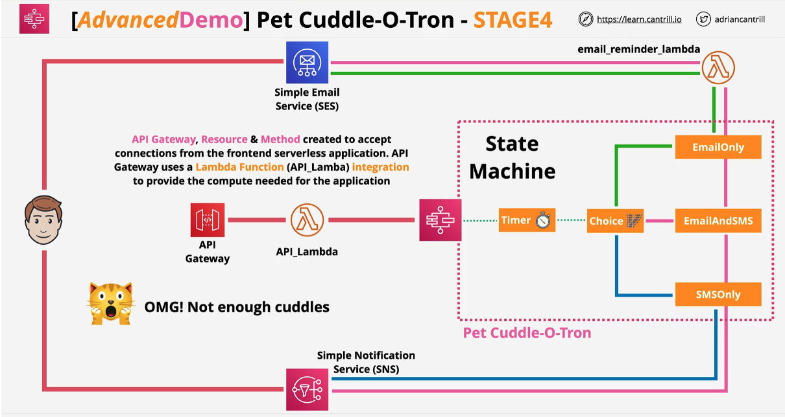
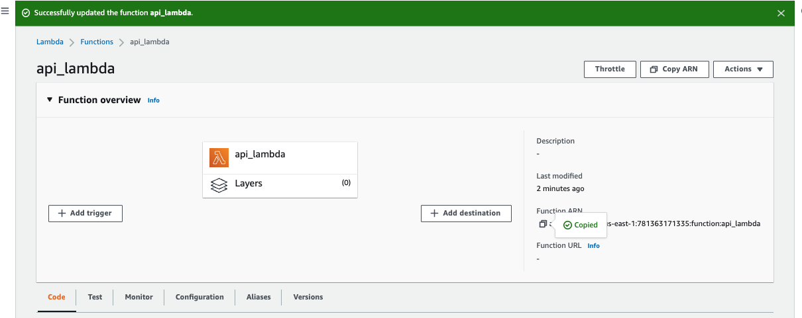
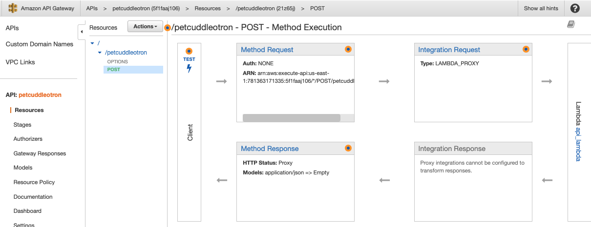
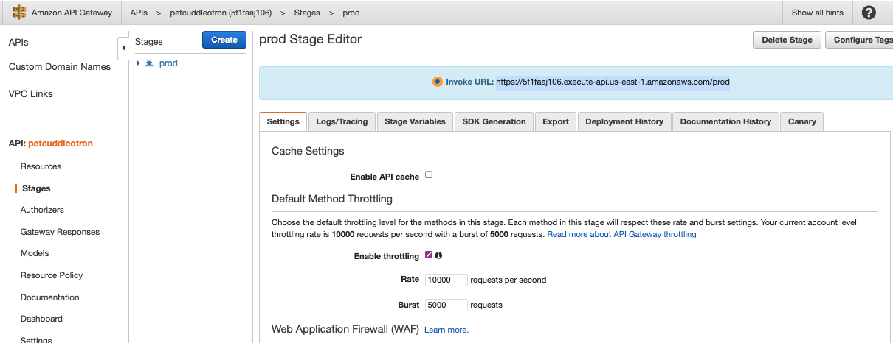

# Advanced Demo Serverless Application - Pet-Cuddle-O-Tron
In this _Advanced Demo_ you will be implementing a serverless reminder application.
The application will load from an S3 bucket and run in browser
.. communicating with Lambda and Step functions via an API Gateway Endpoint
Using the application you will be able to configure reminders for 'pet cuddles' to be send using email and SMS.

This advanced demo consists of 6 stages :-

- STAGE 1 : Configure Simple Email service 
- STAGE 2 : Add a email lambda function to use SES to send emails for the serverless application 
- STAGE 3 : Implement and configure the state machine, the core of the application 
- STAGE 4 : Implement the API Gateway, API and supporting lambda function **<= THIS STAGE**
- STAGE 5 : Implement the static frontend application and test functionality
- STAGE 6 : Cleanup the account

# STAGE4 VIDEO GUIDE 
[STAGE4 VIDEO GUIDE](https://youtu.be/mhFYhpobgOs)

In this stage you will be creating the front end API for the serverless application.  
The front end loads from S3, runs in your browser and communicates with this API.  
It uses API Gateway for the API Endpoint, and this uses Lambda to provide the backing compute.  
First you will create the supporting `API_LAMBDA` and then the `API Gateway`  

# STAGE 4A - CREATE API LAMBDA FUNCTION WHICH SUPPORTS APIGATEWAY

Move to the Lambda console https://console.aws.amazon.com/lambda/home?region=us-east-1#/functions  
Click on `Create Function`  
for `Function Name` use `api_lambda`  
for `Runtime` use `Python 3.9`  
Expand `Change default execution role`  
Select `Use an existing role`  
Choose the `LambdaRole` from the dropdown  
Click `Create Function`  

This is the lambda function which will support the API Gateway

# STAGE 4B - CONFIGURE THE LAMBDA FUNCTION (Using the current UI)

Scroll down, and remove all the code from the `lambda_function` text box  
Open this link in a new tab https://learn-cantrill-labs.s3.amazonaws.com/aws-serverless-pet-cuddle-o-tron/api_lambda.py
depending on your browser it might download the .py file, if so, open it in either your code editor, or notepad on windows, or textedit on a mac and copy it all into your clipboard
Move back to the Lambda console.  
Select the existing lambda code and delete it.  
Paste the code into the lambda fuction.  

This is the function which will provide compute to API Gateway.  
It's job is to be called by API Gateway when its used by the serverless front end part of the application (loaded by S3)
It accepts some information from you, via API Gateway and then it starts a state machine execution - which is the logic of the application.  

You need to locate the `YOUR_STATEMACHINE_ARN` placeholder and replace this with the State Machine ARN you noted down in the previous step.  
Click `Deploy` to save the lambda function and configuration.     

# STAGE 4C - CONFIGURE THE LAMBDA FUNCTION (Using the preview/NEW UI)

Under `Aliases` click `Latest` 
Click the `Code` Tab  
Open this link in a new tab https://learn-cantrill-labs.s3.amazonaws.com/aws-serverless-pet-cuddle-o-tron/api_lambda.py
depending on your browser it might download the .py file, if so, open it in either your code editor, or notepad on windows, or textedit on a mac and copy it all into your clipboard
Move back to the Lambda console.  
Select the existing lambda code and delete it.  
Paste the code into the lambda fuction.  
This is the function which will provide compute to API Gateway.  
It's job is to be called by API Gateway when its used by the serverless front end part of the application (loaded by S3)
It accepts some information from you, via API Gateway and then it starts a state machine execution - which is the logic of the application.  

You need to locate the `YOUR_STATEMACHINE_ARN` placeholder and replace this with the State Machine ARN you noted down in the previous step.  

Click `Deploy as latest`  

# STAGE 4D - CREATE API

Now we have the api_lambda function created, the next step is to create the API Gateway, API and Method which the front end part of the serverless application will communicate with.  
Move to the API Gateway console https://console.aws.amazon.com/apigateway/main/apis?region=us-east-1  
Click `APIs` on the menu on the left  
Locate the `REST API` box, and click `Build` (being careful not to click the build button for any of the other types of API ... REST API is the one you need)
If you see a popup dialog `Create your first API` dismiss it by clicking `OK`  
Under `Create new API` ensure `New API` is selected.  

For `API name*` enter `petcuddleotron`  
for `Endpoint Type` pick `Regional` 
Click `create API`  

# STAGE 4E - CREATE RESOURCE

Click the `Actions` dropdown and Click `Create Resource`  
Under resource name enter `petcuddleotron`  
make sure that `Configure as proxy resource` is **NOT** ticked - this forwards everything as is, through to a lambda function, because we want some control, we **DONT** want this ticked.  
Towards the bottom **MAKE SURE TO TICK** `Enable API Gateway CORS`.  
This relaxes the restrictions on things calling on our API with a different DNS name, it allows the code loaded from the S3 bucket to call the API gateway endpoint.  
**if you DONT check this box, the API will fail**   
Click `Create Resource`  

# STAGE 4F - CREATE METHOD

Ensure you have the `/petcuddleotron` resource selected, click `Actions` dropdown and click `create method`  
In the small dropdown box which appears below `/petcuddleotron` select `POST` and click the `tick` symbol next to it.  
this method is what the front end part of the application will make calls to.  
Its what the api_lambda will provide services for.  

Ensure for `Integration Type` that `Lambda Function` is selected.  
Make sure `us-east-1` is selected for `Lambda Region`  
In the `Lambda Function` box.. start typing `api_lambda` and it should autocomplete, click this auto complete (**Make sure you pick api_lambda and not email reminder lambda**)  

Make sure that `Use Default Timeout` box **IS** ticked.  
Make sure that `Use Lambda Proxy integration` box **IS** ticked, this makes sure that all of the information provided to this API is sent on to lambda for processing in the `event` data structure.  
**if you don't tick this box, the API will fail**  
Click `Save`  
You may see a dialogue stating `You are about to give API Gateway permission to invoke your Lambda function:`. AWS is asking for your OK to adjust the `resource policy` on the lambda function to allow API Gateway to invoke it.  This is a different policy to the `execution role policy` which controls the permissions lambda gets.  

# STAGE 4G - DEPLOY API  

Now the API, Resource and Method are configured - you now need to deploy the API out to API gateway, specifically an API Gateway STAGE.  
Click `Actions` Dropdown and `Deploy API`  
For `Deployment Stage` select `New Stage`  
for stage name and stage description enter `prod`  
Click `Deploy`  

At the top of the screen will be an `Invoke URL` .. note this down somewhere safe, you will need it in the next STAGE.  
This URL will be used by the client side component of the serverless application and this will be unique to you.    

# STAGE 4 - FINISH

At this point you have configured the last part of the AWS side of the serveless application.   
You now have :-

- SES Configured
- An Email Lambda function to send email using SES
- A State Machine configured which can send EMAIL, SMS or BOTH after a certain time period when invoked.
- An API, Resource & Method, which use a lambda function for backing deployed out to the PROD stage of API Gateway

In STAGE5 of this advanced demo you will configure the client side of the application (loaded from S3, running in a browser) so that it communicates to API Gateway.  

