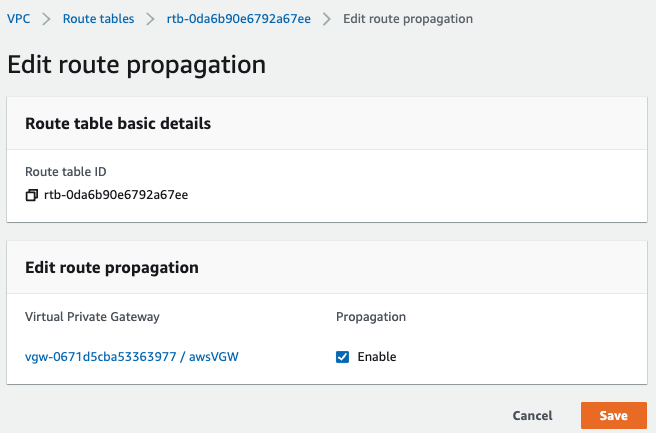
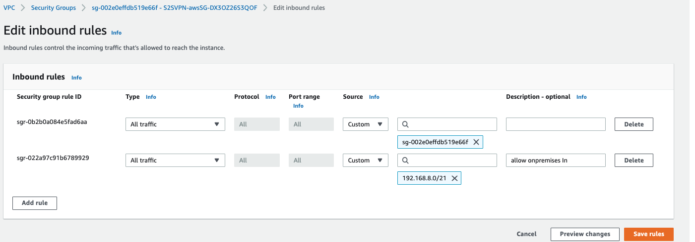
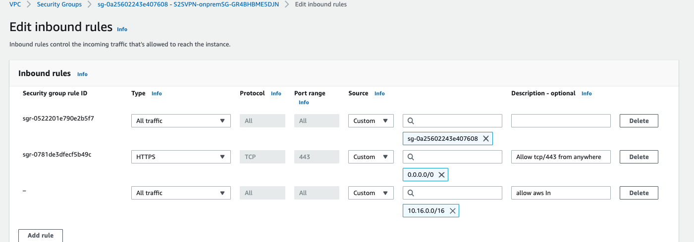
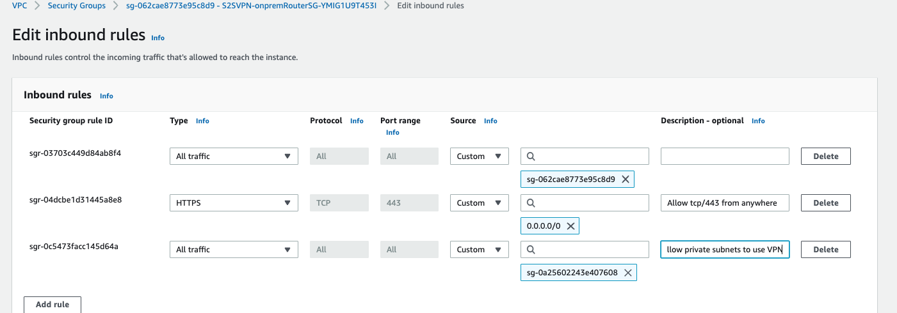

# Advanced Demo - Advanced Demo - Simple Site2Site VPN

- Stage 1 - Create Site2Site VPN 
- Stage 2 - Configure onpremises Router 
- Stage 3 - Routing & Security <= `YOU ARE HERE`
- Stage 4 - Testing
- Stage 5 - Cleanup

# AWS Side Routing

Because we're using a VGW ... we have two options, either adding routes manually or enabling route propegation so that any VGW learned routes will be added to the route table automatically - this is the option we will use for this mini project.  

Go to the `VPC` console, under `Virtual private cloud` click `Route Tables`.  
Select the `rt-aws` route table.  
Click `Routes` and notice how only the AWS VPC Local route of `10.16.0.0/16` exists.  
Click `Route Propegation`. 
Clikc `Edit Route Propegation`. 
Check `Enable` for `awsVGW`, then click `Save` 
Click `Routes` again and notice how a route for the onprem network `192.168.8.0/21` has been added via route propegation.  

# Onprem Side Routing

Because we're using a VGW ... we have two options, either adding routes manually or enabling route propegation so that any VGW learned routes will be added to the route table automatically - this is the option we will use for this mini project.  

Go to the `VPC` console, under `Virtual private cloud` click `Route Tables`.  
Select the `rt-onprem-private` route table.  
Click `Routes` then `Edit Routes`  
Click `Add Route`  
Enter `10.16.0.0/16` in the destination box.  
In the target box, select `Network Interface` then select `onpremRouter Private ENI`  
Click `Save Changes`   

# AWS Side Security Groups

Go to the `VPC` console, under `security` click `Security Groups`.  
Select the `Default A4L aws SG` security group.  
Click `Inbound Rules` and notice how there is no rule for the onpremises networks...   
Click `Edit Inbound Rules`. 
Click `Add rule`.
Adjust to `All Traffic`, Source = Custom, enter `192.168.8.0/21` and `allow onpremises In`, then click `Save Rules`. 

# On-Prem Side Security Groups

Go to the `VPC` console, under `security` click `Security Groups`.  
Select the `Default A4L onprem SG` security group.  
Click `Inbound Rules` and notice how there is no rule for the onpremises networks...   
Click `Edit Inbound Rules`. 
Click `Add rule`.
Adjust to `All Traffic`, Source = Custom, enter `10.16.0.0/16` and `allow aws In`, then click `Save Rules`. 

Go to the `VPC` console, under `security` click `Security Groups`.  
Select the `onprem Router SG` security group.  
Click `Inbound Rules`    
Click `Edit Inbound Rules`. 
Click `Add rule`.
Adjust to `All Traffic`, Source = Custom, enter `S2VPN-onpremSH` and `allow private subnets to use VPN`, then click `Save Rules`. 

