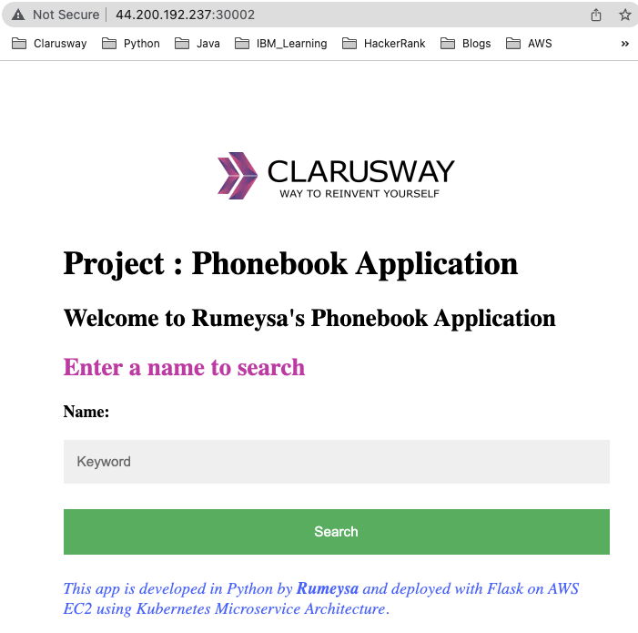
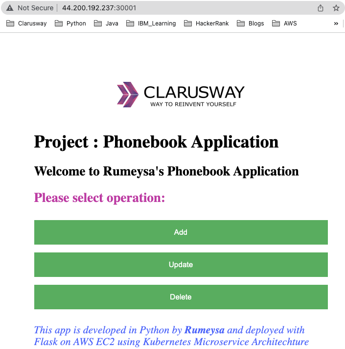

# Solution Steps for Project: 

## Step 1: Create docker images from Docker file for web and result servers with tagging as <your_dockerhub_username>/<name_of_image>
 * create Docker image from Dockerfile under web_server/create_image/ directory with below command
```bash
docker build -t rumeysakdogan/phonebook-webserver .
``` 
 * create Docker image from Dockerfile under result_server/create_image/ directory with below command
```bash
docker build -t rumeysakdogan/phonebook-resultserver .
``` 
## Step 2: Push the newly created images to your Docker Hub repository
  * first login to your docker hub
```bash
docker login
Username:
Password
```
  * second push your images to docker hub
```bash
docker push rumeysakdogan/phonebook-webserver
docker push rumeysakdogan/phonebook-resultserver
``` 
## Step 3: Change image names in webserver_deployment.yml and resultserver_deployment.yml files
  * Under template/spec/container/image change image name to your newly created and pushed Docker image
```sh
 spec:
      containers:
        - name: result-app
          image: rumeysakdogan/phonebook-resultserver 
```
## Step 4: Create secret/configmap
  * Create secret and configmap 
```bash
kubectl apply -f Solution/secret_configMap/
kubectl apply -f path/<directory_of_secret_configmap_yamls>
``` 

## Step 5: Create my_sql database
  * Create mysql_deployment
```bash
kubectl apply -f Solution/mysql_deployment/
kubectl apply -f path/<directory_of_mysql_yamls>
```

## Step 6: Create webserver 
  * Create webserver
```bash
kubectl apply -f Solution/webserver/
kubectl apply -f path/<directory_of_webserver_yamls>
``` 

## Step 7: Create resultserver 
  * Create webserver
```bash
kubectl apply -f Solution/resultserver/
kubectl apply -f path/<directory_of_resultserver_yamls>
``` 

## Step 8: Add Nodeports to security group of Worker Node
  * Resultserver is running on NodePort: 30002
  * Webserver is running on NodePort: 30001

## Step 9: Check your application is up and running
  * Check your app in below urls:
    * Resultserver: <worker_node_public_ip>:30002
  
    * Webserver: <worker_node_public_ip>:30001



